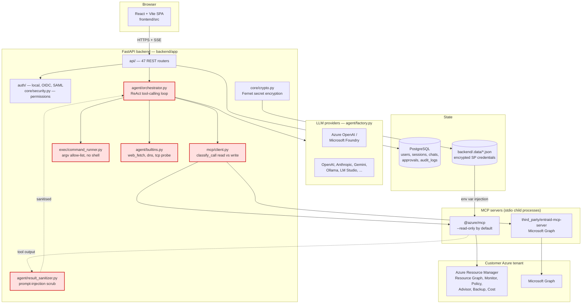
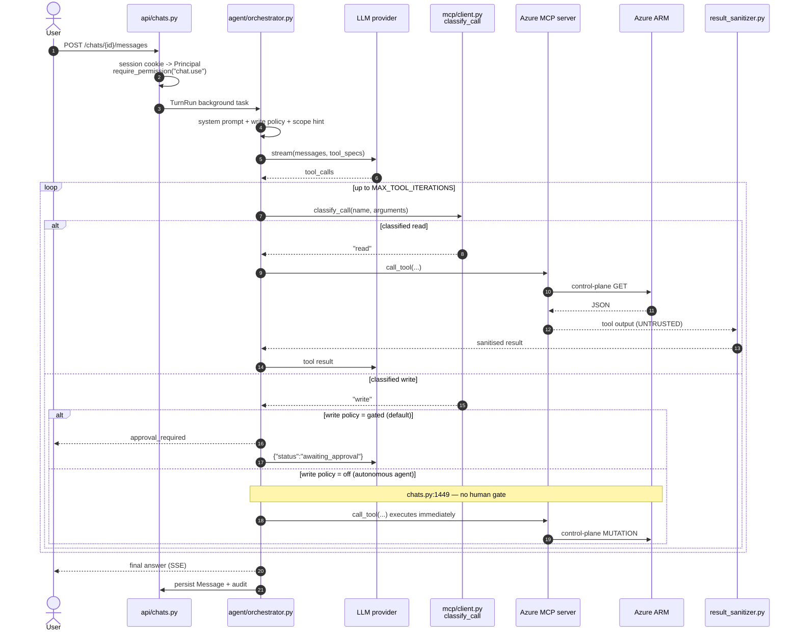

# MDASH readiness — Azure Support Agent

Preparing this repository for **Codename MDASH — Agentic code scanner**, the Microsoft
Defender capability that runs a multi-model agentic pipeline over source code, validates
findings, scores confidence, and publishes results to Microsoft Security Exposure
Management.

> **MDASH** is referred to in Microsoft Learn as *Codename MDASH - Agentic code scanner*.
> This document uses "MDASH" throughout. Every CLI command quoted here is taken from
> published Microsoft Learn documentation; anything not published is explicitly labelled
> **Documentation Required** and is never guessed.

**Companion documents**

| Document | Purpose |
|---|---|
| [azure-validation.md](azure-validation.md) | How to run and read the environment validation scripts |
| [security-review.md](security-review.md) | Conventional security findings and remediation backlog |
| [ai-security-threat-model.md](ai-security-threat-model.md) | AI/agent-specific risk register |
| [recommended-scan-scope.md](recommended-scan-scope.md) | Ranked MDASH scan targets |

---

## 1. Executive summary

Azure Support Agent is an AI-driven Azure operations workbench. Users chat with their
tenant, investigate incidents, and delegate work to specialist agents that assess,
monitor, and remediate cloud issues. It runs inside the customer's own Azure subscription.

That shape makes it an unusually high-value MDASH target: the codebase combines an
**LLM orchestration loop**, a **tool-calling bridge to live Azure control-plane APIs**, a
**command execution sandbox**, and a **multi-tenant credential store** — in one process.
A vulnerability in the agent layer is not a data-integrity bug; it is a path to
unauthorised Azure control-plane actions.

### Current readiness

The read-only validation script was executed against the target environment, before and
after provisioning the MDASH model deployments:

| Outcome | Baseline | After CI scaffolding | **After model deployment** |
|---|---|---|---|
| Passed | 26 | 27 | **30** |
| **Failed (blocking)** | 4 | 4 | **1** |
| Warnings | 3 | 2 | 2 |
| Skipped | 0 | 0 | 0 |

Three of the four original blockers are cleared: `gpt-5.4`, `gpt-5.3-codex`, and
`gpt-5.4-mini` are deployed at 1,000,000 TPM each with a dedicated MDASH content filter.

**One blocker remains, and it cannot be fixed from this subscription:** the Foundry account
enforces `disableLocalAuth: true`, so no API key can be issued — and documented MDASH
onboarding requires a project endpoint **and** an API key. See
[section 6](#6-mdash-readiness-checklist).

**The environment is not yet ready to run an MDASH scan.** Four blockers, all in the
Foundry configuration, are listed in [section 6](#6-mdash-readiness-checklist). The
repository-side preparation — scan scope, threat model, security review, CI scaffolding —
is complete and delivered by this change.

### What this change adds

- A repeatable, **read-only** Azure validation script in both PowerShell and Bash.
- A ranked MDASH scan scope so the first scan targets the highest-risk code.
- An AI-specific threat model covering prompt injection, tool abuse, and autonomous
  remediation.
- A conventional security review with a prioritised remediation backlog.
- CodeQL, dependency-review, and Dependabot configuration so MDASH results land next to
  GitHub Advanced Security results rather than in a silo.

### What this change deliberately does not do

- It does not create an Azure AI Foundry project. The existing project is discovered and
  reused.
- It does not create, modify, or delete any Azure resource.
- It does not add a workflow that consumes secrets. The MDASH pipeline workflow is
  provided as a documented, opt-in template in [section 10](#10-cicd-integration) instead.

---

## 2. Architecture overview

### System overview

Azure Support Agent is a FastAPI backend plus a React/TypeScript SPA. The backend hosts
an agent orchestrator that talks to a pluggable LLM provider and reaches Azure through
Model Context Protocol (MCP) servers spawned as child processes.



Red nodes are the security-critical paths and map directly to the Critical/High entries in
[recommended-scan-scope.md](recommended-scan-scope.md).

### Data flow — a single chat turn



Steps 12–13 and the `write policy = off` branch are the two highest-value MDASH targets.
See [AI-01](ai-security-threat-model.md) and [AI-06](ai-security-threat-model.md).

---

## 3. Azure environment assumptions

Everything in this document was validated against a real environment on
**2026-07-31**. No value below is invented.

| Setting | Value |
|---|---|
| Subscription name | `MCAPS-Hybrid-rafaelcas` |
| Subscription ID | `4bd56768-1b2f-4c85-951f-68ce70b7c999` |
| Tenant | `Microsoft Non-Production` — `16b3c013-d300-468d-ac64-7eda0820b6d3` |
| Resource group | `rg-ip-mdash-AzureSupportAgent` |
| Location | `swedencentral` |
| Signed-in principal | `rafaelcas@microsoft.com` (Owner + Foundry User at RG scope) |

The subscription ID is **resolved from the subscription name at run time** by both
validation scripts, so the scripts stay correct if the ID ever changes:

```bash
az account list --all --query "[?name=='MCAPS-Hybrid-rafaelcas'].id" -o tsv
```

### Assumptions

1. The operator can sign in to the `Microsoft Non-Production` tenant. This subscription is
   not visible from the default `Microsoft` tenant, so `az login --tenant` is required.
2. The resource group already exists. The scripts never create it.
3. The Foundry project already exists. The scripts never create it.
4. Reader on the resource group is sufficient to run validation. Contributor (or
   Cognitive Services Contributor) is needed only to deploy the MDASH models.
5. `Microsoft.Security` and `Microsoft.CognitiveServices` providers are registered.

---

## 4. Subscription and resource group configuration

Both validation scripts default to the values above, and both accept overrides so the same
scripts work in another environment without editing.

```powershell
# PowerShell — defaults shown explicitly
./scripts/validate-azure-mdash-readiness.ps1 `
    -SubscriptionName 'MCAPS-Hybrid-rafaelcas' `
    -ResourceGroupName 'rg-ip-mdash-AzureSupportAgent'
```

```bash
# Bash — defaults shown explicitly
./scripts/validate-azure-mdash-readiness.sh \
    --subscription "MCAPS-Hybrid-rafaelcas" \
    --resource-group "rg-ip-mdash-AzureSupportAgent"
```

Pin the CLI to this subscription before any other work:

```bash
az account set --subscription 4bd56768-1b2f-4c85-951f-68ce70b7c999
```

Or let the script do it, which resolves the ID from the name first:

```bash
./scripts/validate-azure-mdash-readiness.sh --set-context
```

---

## 5. Existing Microsoft Foundry project

**No new Foundry project is created.** The existing project is discovered and reused.

### Discovered resources

| Property | Value |
|---|---|
| Foundry account | `rafaelcas-msfoundry-resource-mda` |
| Resource type | `Microsoft.CognitiveServices/accounts`, kind `AIServices`, SKU `S0` |
| Account endpoint | `https://rafaelcas-msfoundry-resource-mda.cognitiveservices.azure.com/` |
| Account identity | System-assigned, principal `49f682b8-e477-4bce-93fe-0266a1a8fea7` |
| Foundry project | `rafaelcas-msfoundry-project-mdash` (`isDefault: true`) |
| Resource type | `Microsoft.CognitiveServices/accounts/projects` |
| **Project endpoint** | `https://rafaelcas-msfoundry-resource-mda.services.ai.azure.com/api/projects/rafaelcas-msfoundry-project-mdash` |
| Project identity | System-assigned, principal `0f362346-5555-46a0-8960-018c5be861c6` |
| Local (key) auth | **Disabled** — `disableLocalAuth: true`, tenant-enforced |
| Public network access | `Enabled` |
| Model deployments | `gpt-5.4`, `gpt-5.3-codex`, `gpt-5.4-mini` — all GlobalStandard @ 1000 K TPM |
| Content filter | `mdash-permissive` (custom) on all three deployments |

### How discovery works

A Microsoft Foundry resource is a `Microsoft.CognitiveServices/accounts` resource with
`kind == "AIServices"`; the project is a child `.../projects` resource. The scripts filter
on exactly that, rather than matching on a name, so they keep working if the resource is
renamed:

```bash
# 1. Find the Foundry account (kind AIServices) in the resource group
az cognitiveservices account list \
  --resource-group rg-ip-mdash-AzureSupportAgent \
  --query "[?kind=='AIServices']"

# 2. Find its project, and read the project endpoint
az resource list \
  --resource-type Microsoft.CognitiveServices/accounts/projects \
  --resource-group rg-ip-mdash-AzureSupportAgent

az resource show --ids "<project-resource-id>" --api-version 2025-06-01 \
  --query "properties.endpoints.\"AI Foundry API\"" -o tsv
```

If more than one Foundry account exists, the scripts warn and use the first; pass
`-FoundryAccountName` / `--foundry-account` to make the selection deterministic.

### Why a dedicated resource matters

Microsoft Learn requires the MDASH Foundry resource to use a **permissive content filter**
(all severity thresholds at minimum, prompt shields off) because MDASH sends security
content that default filters would misclassify as harmful and block. Learn is explicit:

> Create and use a dedicated Microsoft Foundry endpoint for MDASH only. Do not use this
> endpoint for any other workload.

`rafaelcas-msfoundry-project-mdash` is named for, and dedicated to, MDASH. **Azure Support
Agent's own LLM provider must not be pointed at this endpoint** — a permissive filter is
correct for a scanner and wrong for a tenant-facing agent. This is tracked as
[AI-14](ai-security-threat-model.md).

---

## 6. MDASH readiness checklist

Legend: ✅ satisfied · ❌ blocking · ⚠️ recommended · 📄 Documentation Required

### Azure environment

| # | Requirement | Status | Evidence / action |
|---|---|---|---|
| 1 | Azure CLI installed | ✅ | `az 2.80.0` |
| 2 | Signed in to the correct tenant | ✅ | `16b3c013-…` (Microsoft Non-Production) |
| 3 | Subscription visible by name | ✅ | `MCAPS-Hybrid-rafaelcas` |
| 4 | Subscription ID resolved | ✅ | `4bd56768-1b2f-4c85-951f-68ce70b7c999` |
| 5 | Subscription enabled | ✅ | state `Enabled` |
| 6 | Resource group exists | ✅ | `rg-ip-mdash-AzureSupportAgent`, `swedencentral` |
| 7 | `Microsoft.CognitiveServices` registered | ✅ | Registered |
| 8 | `Microsoft.Security` registered | ✅ | Registered |
| 9 | `Microsoft.DBforPostgreSQL` registered | ⚠️ | **NotRegistered** — blocks `deploy/main.bicep`, not MDASH |

### Microsoft Foundry

| # | Requirement | Status | Evidence / action |
|---|---|---|---|
| 10 | Dedicated Foundry resource exists | ✅ | `rafaelcas-msfoundry-resource-mda` |
| 11 | Foundry project exists | ✅ | `rafaelcas-msfoundry-project-mdash` |
| 12 | Project endpoint obtainable | ✅ | See [section 5](#5-existing-microsoft-foundry-project) |
| 13 | Region offers all required models | ✅ | `gpt-5.4`, `gpt-5.3-codex`, `gpt-5.4-mini` all in `swedencentral` |
| 14 | `gpt-5.4` deployed | ✅ | GlobalStandard, 1000 K TPM |
| 15 | `gpt-5.3-codex` deployed | ✅ | GlobalStandard, 1000 K TPM |
| 16 | `gpt-5.4-mini` deployed | ✅ | GlobalStandard, 1000 K TPM |
| 17 | Each deployment ≥ 1,000,000 TPM | ✅ | All three at the minimum exactly |
| 18 | **API key obtainable for onboarding** | ❌ | `disableLocalAuth: true`, tenant-enforced — see below |
| 19 | MDASH can reach the endpoint | ✅ | `publicNetworkAccess: Enabled` = "All networks", no IP allow-list needed |
| 20 | Permissive content filter applied | ⚠️ | `mdash-permissive` applied; jailbreak shield and protected-material off, but harm categories cannot be fully disabled without an approved exception |
| 20b | `MAI-Cyber-1-Flash` deployed | ❌ | **Not offered in any region of this subscription** — gated preview |

### Defender and identity

| # | Requirement | Status | Evidence / action |
|---|---|---|---|
| 21 | Defender CSPM (`CloudPosture`) Standard | ✅ | Enabled |
| 22 | Defender for AI (`AI`) Standard | ✅ | Enabled |
| 23 | Global Admin or Security Admin for onboarding | 📄 | Directory role — verify outside this subscription |
| 24 | Defender unified RBAC role created | 📄 | Portal step, see [section 8](#8-defender-rbac-and-permissions) |
| 25 | Microsoft Defender Code enterprise app present | 📄 | Auto-provisioned for E5 tenants |

### Repository

| # | Requirement | Status | Evidence / action |
|---|---|---|---|
| 26 | Hosted on GitHub | ✅ | `github.com/cassolato/AzureSupportAgent` |
| 27 | Scan scope defined | ✅ | [recommended-scan-scope.md](recommended-scan-scope.md) |
| 28 | Threat model defined | ✅ | [ai-security-threat-model.md](ai-security-threat-model.md) |
| 29 | GHAS workflows present | ✅ | Added by this change — [section 10](#10-cicd-integration) |

### Blocker detail

**Blockers 14–17 — RESOLVED.** All three models are now deployed at 1,000,000 TPM.
Quota consumed (values are thousands of TPM):

| Model | Used before | Deployed | Limit | Remaining |
|---|---|---|---|---|
| `gpt-5.4` (GlobalStandard) | 0 | 1,000 | 1,000 | **0** |
| `gpt-5.4-mini` (GlobalStandard) | 0 | 1,000 | 1,000 | **0** |
| `gpt-5.3-codex` (GlobalStandard) | 500 | 1,000 | 3,000 | 1,500 |

`gpt-5.4` and `gpt-5.4-mini` GlobalStandard quota in `swedencentral` is now **fully
consumed**. Any other workload needing those models in this region will fail to deploy
until a quota increase is granted.

**Blocker 18 — `disableLocalAuth: true`, and it cannot be changed here.** This is the one
remaining blocker. Microsoft Learn's onboarding step 3 requires a **Project endpoint and an
API key**:

> Enter the **Project endpoint** … and **API key**. Select **Validate** to verify the
> connection.

Attempts to clear the flag were made and **rejected by the platform**:

```text
# ARM accepted the request but returned the property unchanged
az resource update ... --set properties.disableLocalAuth=false   # exit 0, value stays true
az rest --method patch ... '{"properties":{"disableLocalAuth":false}}'  # 200 OK, value stays true

# And key retrieval fails accordingly
az cognitiveservices account keys list ...
#   (BadRequest) Failed to list key. disableLocalAuth is set to be true
```

No Azure Policy assignment in the subscription explains it, so the control is applied
above the subscription — a management-group or tenant-level governance baseline in
`Microsoft Non-Production` mandating Entra-only authentication on Cognitive Services
accounts. Resolution requires a governance exception, or Entra-only onboarding support
from the MDASH team.

**Blocker 20b — `MAI-Cyber-1-Flash` is unobtainable in this subscription.** Every physical
Azure region was queried; the model is absent from all of them. Only `MAI-Image-*` models
are offered. It is a gated preview, so `mai-augmented-profile` cannot be used and
`gpt-general-profile` is the only usable option here. See
[section 9b](#9b-mai-cyber-1-flash-and-the-mai-augmented-profile).

**Additional blocker found at scan time — tenant not on the MDASH allow-list.** With the
Defender CLI installed and a valid Entra token, the service rejects the caller:

```text
Error: list model profiles: scannersvc: list model profiles: aiscan:
       caller not authorized (token valid, allowed-callers list)
```

The token is accepted; the tenant is simply not enrolled in the MDASH preview. Portal
onboarding must complete first.

---

## 7. Azure validation steps

Full detail is in [azure-validation.md](azure-validation.md). Short version:

```powershell
# PowerShell 7+
cd <repo-root>
./scripts/validate-azure-mdash-readiness.ps1 -SetContext
```

```bash
# Bash — requires az and jq
cd <repo-root>
chmod +x scripts/validate-azure-mdash-readiness.sh
./scripts/validate-azure-mdash-readiness.sh --set-context
```

Exit codes: `0` ready · `1` blocking failure · `2` cannot run.

---

## 8. Defender RBAC and permissions

Portal steps, from Microsoft Learn. These are directory- and portal-scoped, so no script
here can perform or verify them.

1. Microsoft Defender portal → **System** → **Permissions**.
2. **Microsoft Defender XDR** → **Roles** → **Create custom role**.
3. On **Choose permissions**, expand **Agentic code security** → **AI Scan Security**:

   | Permission | Needed for |
   |---|---|
   | Run scan (Manage) | Triggering on-demand or CLI scans |
   | Upload results (Manage) | Uploading CLI scan results to Defender |
   | Scan results (Read) | Viewing findings in the portal and initiative |
   | Scan results (Manage) | Triaging and dismissing findings |

4. Under **Data sources**, keep **Microsoft Defender for Cloud** *and* **Microsoft
   Security Exposure Management** selected.

Entra directory roles required:

| Task | Role |
|---|---|
| Complete MDASH onboarding | Global Administrator **or** Security Administrator |
| Interactive CLI authentication | Security Administrator |
| Register the CI/CD app | Application Administrator |
| Grant admin consent to that app | Global Administrator |

---

## 9. Running an MDASH scan

All commands below are published on Microsoft Learn.

### Install the Defender CLI

```powershell
# Windows x64
Invoke-WebRequest `
    -Uri "https://cli.dfd.security.azure.com/public/v2/latest/Defender_win-x64.exe" `
    -OutFile "defender.exe"
```

```bash
# Linux x64
curl -fL -o defender "https://cli.dfd.security.azure.com/public/v2/latest/Defender_linux-x64"
chmod +x defender
```

### Authenticate interactively

```bash
export DEFENDER_DFD_TENANT_ID=16b3c013-d300-468d-ac64-7eda0820b6d3

az login \
  --tenant "$DEFENDER_DFD_TENANT_ID" \
  --scope c2fd607e-fe6e-41bd-ae58-08e2f24014aa/Defender.InteractiveLogin \
  --allow-no-subscriptions \
  --use-device-code
```

### Scan

```powershell
# Whole repository, synchronous
defender scan ai-scan submit .

# Highest-risk subset first — see recommended-scan-scope.md
defender scan ai-scan submit ./backend/app/agent
defender scan ai-scan submit ./backend/app/mcp
defender scan ai-scan submit ./backend/app/exec

# Critical and high findings only
defender scan ai-scan submit . --severity high

# Explicit model profile (mai-augmented-profile is unavailable in swedencentral)
defender scan ai-scan submit . --model-profile gpt-general-profile
```

### Long-running scans

```powershell
defender scan ai-scan submit .          # returns a job id
defender status <JOB_ID>                # check progress
defender status wait <JOB_ID> -o results.sarif
defender status result <JOB_ID>         # download a finished report
defender status log <JOB_ID>            # path to the auto-saved debug log
defender status cancel <JOB_ID>         # stop scheduling new work
```

Cancelling does **not** refund tokens already consumed.

Inspect available profiles:

```powershell
defender scan profile model list
defender scan profile model show-default
```

### Applying AI-generated fixes

Microsoft Learn documents that `defender fix` exists but publishes no argument syntax. The
syntax below was obtained from the installed binary (`defender 3.0.0-rc.34`) via
`defender fix --help`, so it is verified rather than guessed:

```text
defender fix <sarif-file> [flags]

  --severity string   Minimum severity to fix: critical | high | medium | low
                      (default "high" = high and critical only)
  -y, --yes           Skip the interactive RAI apply confirmation prompt
  -q, --quiet         Suppress lifecycle logs
```

```powershell
defender fix ./defender-fs-AzureSupportAgent-20260731-1500.sarif
defender fix ./results.sarif --severity low     # fix everything
```

Two properties of this command matter for this repository:

1. **It is not a dry run.** It calls the GitHub Copilot CLI to edit files in place in the
   working directory. It requires the standalone `copilot` CLI, or `gh` with the Copilot
   extension, on `PATH`.
2. **It must be run on a clean git tree.** The CLI's own help says so, and it is the only
   way to `git diff` the generated edits before keeping them.

Regardless of syntax: treat `defender fix` output as a **proposal**, never an auto-merge.
Every Critical and High target in this repository touches an agent, credential, or Azure
control-plane path and must go through human review.

## 9b. MAI-Cyber-1-Flash and the MAI-augmented profile

Microsoft announced **MAI-Cyber-1-Flash inside MDASH** on 27 July 2026. It is the
highest-performing option MDASH offers:

| Metric | Reported |
|---|---|
| CyberGym score, MDASH + MAI-Cyber-1-Flash + GPT-5.4 | **95.95 %** |
| Next-best compared models | 83.2 % – 85.6 % |
| Uplift over Mythos | +12 points |
| Cost vs the GPT-5.4 + 5.4-mini + 5.3-codex trio | **50 % lower** |

The design is a routing system: MAI-Cyber-1-Flash handles up to 90 % of tasks, and GPT-5.4
is reserved for the ~10 % that are genuinely hard. That is where both the accuracy and the
cost saving come from. The model is a compact, code-heavy security model from the
MAI-Thinking-1 lineage.

**It cannot be deployed in this environment.** Every physical Azure region in subscription
`MCAPS-Hybrid-rafaelcas` was queried for the model:

```bash
# Returns MAI-Image-2, MAI-Image-2.5, MAI-Image-2.5-Flash, MAI-Image-2.5-Pro, MAI-Image-2e
# MAI-Cyber-1-Flash is absent from every region.
az cognitiveservices model list --location <region> --query "[].model.name" -o tsv \
  | grep -i 'mai-cyber'
```

MDASH documentation also notes the MAI-augmented profile is Preview and *"currently
available only for scans triggered through the Defender CLI"*. Access is therefore gated
rather than self-service.

**Consequence for this repository:** use `gpt-general-profile`, which the three deployed
models satisfy. Once MAI-Cyber-1-Flash becomes available to this tenant, deploy it and
switch:

```powershell
defender scan ai-scan submit . --model-profile mai-augmented-profile
```

Given the 50 % cost reduction and the +10-point accuracy gain, moving to
`mai-augmented-profile` should be treated as the default target state for scanning this
repository, not an optional upgrade.

### Network allow-list

If outbound traffic is restricted, these must be reachable from the scanning host:

| Purpose | Domains |
|---|---|
| `defender scan ai-scan` | `*.cli.dfd.security.azure.com`, `*.blob.core.windows.net`, `*.azurefd.net`, `*.login.microsoftonline.com`, `*.graph.microsoft.com` |
| GitHub Actions OIDC | `*.token.actions.githubusercontent.com` |
| Azure Pipelines OIDC | `*.dev.azure.com` |
| Telemetry (recommended) | `*.in.applicationinsights.azure.com`, `*.dc.services.visualstudio.com` |
| `scan fs` | `*.ghcr.io`, `*.public.ecr.aws`, `*.registry-1.docker.io`, `*.auth.docker.io` |

---

## 10. CI/CD integration

### Added by this change (no secrets required)

| File | Purpose |
|---|---|
| `.github/workflows/codeql.yml` | CodeQL for Python and TypeScript, `security-extended` queries |
| `.github/workflows/dependency-review.yml` | Blocks PRs introducing high-severity vulnerable dependencies |
| `.github/dependabot.yml` | Weekly updates for pip, npm, Docker, and Actions |

All three run on the `GITHUB_TOKEN` alone.

### MDASH pipeline workflow — opt-in template

This is **not** committed as an active workflow because it requires three secrets. Add it
deliberately, after the blockers in section 6 are cleared.

Required repository secrets:

| Secret | Source |
|---|---|
| `DEFENDER_ASPM_TENANT_ID` | App registration → Directory (tenant) ID |
| `DEFENDER_ASPM_CLIENT_ID` | App registration → Application (client) ID |
| `DEFENDER_ASPM_CLIENT_SECRET` | App registration → Certificates & secrets |

The app registration needs `AIScan.enabled` and `AIScan.Upload` application permissions on
**Microsoft Defender Code**, with Global Administrator consent granted.

```yaml
# .github/workflows/mdash-scan.yml  (TEMPLATE — review before enabling)
name: MDASH agentic code scan

on:
  workflow_dispatch:
  schedule:
    - cron: '0 3 * * 1'   # weekly; agentic scans are slow and consume tokens

permissions:
  contents: read
  security-events: write   # required to upload SARIF

jobs:
  ai-scan:
    runs-on: ubuntu-latest
    timeout-minutes: 360
    steps:
      - uses: actions/checkout@v4

      - name: Install Defender CLI
        run: |
          curl -fL -o defender \
            "https://cli.dfd.security.azure.com/public/v2/latest/Defender_linux-x64"
          chmod +x defender

      - name: Run agentic scan
        env:
          DEFENDER_ASPM_TENANT_ID:     ${{ secrets.DEFENDER_ASPM_TENANT_ID }}
          DEFENDER_ASPM_CLIENT_ID:     ${{ secrets.DEFENDER_ASPM_CLIENT_ID }}
          DEFENDER_ASPM_CLIENT_SECRET: ${{ secrets.DEFENDER_ASPM_CLIENT_SECRET }}
        run: ./defender scan ai-scan submit . --severity high

      - name: Upload SARIF to GitHub code scanning
        if: always()
        uses: github/codeql-action/upload-sarif@v3
        with:
          sarif_file: results.sarif
          category: mdash
```

```text
SARIF output path — RESOLVED from `defender scan ai-scan submit --help`.
Default: <target>/defender-fs-<repo>-<YYYYMMDD-HHMMSS>.sarif
Because the filename carries a timestamp, always pass -o explicitly in CI so the
upload step has a deterministic path:
    defender scan ai-scan submit . --async -o results.sarif
```

The `--severity high` filter keeps token spend and run time predictable on a scheduled
job. Drop it for a full baseline scan.

### Recommended branch protection

| Control | Recommendation |
|---|---|
| Required reviewers | ≥ 1; ≥ 2 for `backend/app/agent`, `backend/app/mcp`, `backend/app/exec`, `deploy/` |
| Required status checks | CodeQL, dependency-review |
| Dismiss stale approvals | On |
| Require conversation resolution | On |
| Force push / deletion | Blocked on `main` |
| CODEOWNERS | Add for the Critical paths in [recommended-scan-scope.md](recommended-scan-scope.md) |

---

## 11. Recommended MDASH scan plan

Full ranking, with rationale per path, is in
[recommended-scan-scope.md](recommended-scan-scope.md). Sequenced:

| Wave | Scope | Why first |
|---|---|---|
| 1 | `backend/app/agent`, `backend/app/mcp`, `backend/app/exec` | Orchestration, read/write classification, command execution — the paths that convert a prompt into an Azure action |
| 2 | `backend/app/auth`, `backend/app/core`, `backend/app/azure` | AuthN/AuthZ, Fernet crypto, multi-tenant credential handling |
| 3 | `backend/app/api` | 47 routers; the entire internet-facing surface |
| 4 | `deploy/`, `Dockerfile`, `docker-compose.yml` | IaC and container posture |
| 5 | `frontend/src` | XSS, unsafe rendering of agent output |
| 6 | `third_party/` | Vendored Entra MCP server — supply chain |

Excluded from early waves: `docs/`, `frontend/public`, `**/demo*.py`, test plans.

---

## 12. Remediation backlog

Consolidated from [security-review.md](security-review.md) and
[ai-security-threat-model.md](ai-security-threat-model.md).

| Priority | ID | Item |
|---|---|---|
| P0 | AI-01 | Autonomous agents bypass the approval gate (`api/chats.py:1449`) |
| P0 | AI-02 | MCP consent elicitation auto-accepted (`mcp/client.py:137-173`) |
| P0 | SEC-01 | Container App has no managed identity; SP secrets injected as env vars |
| P1 | AI-03 | Prompt-injection defence is regex-only (`agent/result_sanitizer.py`) |
| P1 | AI-04 | LLM-authored agent configs may set `run_mode: autonomous` |
| P1 | SEC-02 | PostgreSQL `0.0.0.0` firewall rule in public mode (`deploy/main.bicep:350`) |
| P1 | SEC-03 | Mutable `:latest` container tag (`deploy/main.bicep:12`) |
| P2 | AI-05 | Write classification relies on verb tokens |
| P2 | SEC-04 | No Key Vault in the resource group for `SECRETS_ENCRYPTION_KEY` |
| P2 | AI-06 | VM command execution has an autonomous mode (`agent/vm_tools.py`) |

---

## 13. Troubleshooting

| Symptom | Cause | Fix |
|---|---|---|
| `Subscription 'MCAPS-Hybrid-rafaelcas' visible … FAIL` | Signed in to the wrong tenant | `az login --tenant 16b3c013-d300-468d-ac64-7eda0820b6d3` |
| Script reports a different active subscription | Context not switched | Re-run with `-SetContext` / `--set-context` |
| `Resource group … FAIL` | Wrong name, or no Reader | Verify the name; request Reader. The script never creates it |
| `Foundry (AIServices) account discovered … FAIL` | No Foundry resource in the RG | Confirm the RG. A hub-based ML workspace is reported separately and is not a substitute |
| `Model deployed … FAIL` | Models not deployed | Foundry portal → Build → Deployments |
| `Foundry API key auth available … FAIL` | `disableLocalAuth: true` | See blocker 18 in [section 6](#6-mdash-readiness-checklist) |
| Portal **Validate** fails | Endpoint unreachable, or key missing | Confirm `publicNetworkAccess`; if "Selected networks", add the MDASH IP ranges |
| `Role assignments … SKIP` | Signed in as a service principal | Re-run as a user, or use `--skip-rbac` and verify in the portal |
| `jq: command not found` | Bash script prerequisite | `apt install jq` / `brew install jq`, or use the PowerShell script |
| Deployment fails on PostgreSQL | Provider not registered | `az provider register --namespace Microsoft.DBforPostgreSQL` |
| Quota error deploying `gpt-5.4` | Zero spare GlobalStandard quota in region | Request an increase, or lower TPM (below 1M reduces scan throughput) |

---

## 14. Known limitations

1. **~~`defender fix` syntax is undocumented.~~ RESOLVED** from the installed CLI
   (`3.0.0-rc.34`). See [section 9](#9-running-an-mdash-scan). Note it edits files in place
   and needs the Copilot CLI on `PATH`.
2. **~~SARIF output filename is undocumented.~~ RESOLVED** \u2014 default is
   `<target>/defender-fs-<repo>-<YYYYMMDD-HHMMSS>.sarif`. Pass `-o` in CI for determinism.
3. **No MDASH scan has been run.** Two blockers prevent it: the Foundry account cannot
   issue an API key, and the tenant is not on the MDASH allow-list
   (`caller not authorized`). The scan scope is a static, evidence-based prioritisation,
   not a triaged result set.
4. **`disableLocalAuth` cannot be changed from this subscription.** ARM accepts the write
   and silently retains `true`, indicating enforcement above the subscription. A governance
   exception is required.
5. **`MAI-Cyber-1-Flash` is unobtainable here**, so the higher-accuracy, lower-cost
   `mai-augmented-profile` cannot be used despite being the better option.
6. **The permissive content filter is only partially permissive.** Jailbreak and
   protected-material filters are off, but the four harm categories cannot be disabled
   without an approved exception (`aka.ms/oai/rai/exceptions`); they sit at the most
   permissive threshold allowed (`High`). MDASH may still see some content blocked.
7. **Directory-scoped prerequisites are unverifiable from here.** Entra role membership,
   Defender unified RBAC roles, and the Microsoft Defender Code enterprise app are tenant
   and portal concerns; the scripts do not attempt them.
8. **The validation scripts are read-only by design.** They never remediate. Every failure
   carries guidance instead.
9. **Findings in this document are from static review**, not runtime testing or
   exploitation. Severities are engineering judgement and should be re-rated against
   actual MDASH confidence scores.
10. **Quota is fully consumed** for `gpt-5.4` and `gpt-5.4-mini` GlobalStandard in
    `swedencentral`. Any competing workload will fail to deploy.
